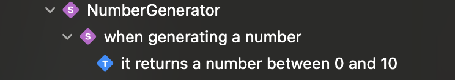

# SwiftSpec (WIP)

A RSpec inspired collection of swift macros

> ! Why it is not working !
>
> "* macro declarations can never be produced by a macro, because allowing this would allow a macro to trivially produce infinitely recursive macro expansion."
>
> [Permitted declaration kinds](https://github.com/swiftlang/swift-evolution/blob/main/proposals/0389-attached-macros.md#permitted-declaration-kinds)
>

Getting an error:

`Instance member [...] cannot be used on instance of nested type`

```
Instance member '$s15SwiftSpecClient05MacroB0O20NumberGeneratorTestsV28WhenGeneratingANumberContextV22it_should_do_something4TestfMp_39funcit_should_do_something__asyncthrowsfMu_' of type 'MacroSpec.NumberGeneratorTests.WhenGeneratingANumberContext' cannot be used on instance of nested type 'MacroSpec.NumberGeneratorTests.WhenGeneratingANumberContext.$s15SwiftSpecClient05MacroB0O20NumberGeneratorTestsV28WhenGeneratingANumberContextV22it_should_do_something4TestfMp_69__🟠$test_container__function__funcit_should_do_something__asyncthrowsfMu_'
```

```swift
import Testing

import SwiftSpec

enum ExpandedSpec {

    // #define
    @Suite("NumberGenerator")
    struct NumberGeneratorTests {

        // #context
        @Suite("when generating a number")
        struct WhenCalled {

            // #it
            @Test("it returns a number between 0 and 10")
            func it_returns_a_number_between_0_and_10() async throws {
                #expect(true)
            }
        }
    }
}

enum MacroSpec {

    #define("NumberGenerator") {
        #context("when generating a number") {
            #it("it returns a number between 0 and 10") {
                #expect(false == true)
            }
        }
    }
}
```



## Learnings

_Swift 6.0_

* (freestanding) "'declaration' macros are not allowed to introduce arbitrary names at global scope".
  They must be nested within a type.
* Macros can not expand other macros. Nesting is prohibited.
* The macro expansion tests are not 100% reliable as they only check for the expanded output not if the expanded code is actually compiling.

## Resources

* [RSpec basic structure](https://rspec.info/features/3-12/rspec-core/example-groups/basic-structure/)
* Blog on creating freestanding declaration macro: https://quickbirdstudios.com/blog/swift-macros/
* [Swift ADST Explorer](https://swift-ast-explorer.com/)
* [About nested macros](http://csl.cool/2023/06/13/ios-dev/my-first-swift-macro/#nested-macros)
